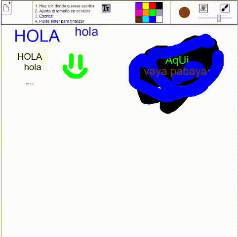

# Creando-Interfaces-de-Usuario
## Practica 8 - Paint en P5JS
### Autor - Rubén Garcia Quintana

### Introducción
La práctica consiste en usar P5JS para realizar una versión del programa "Paint" en el que al menos se pueda dibujar con un pincel, cambiar el color, y cambiar el grosor del pincel.

